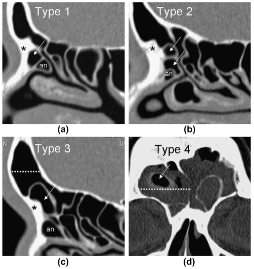
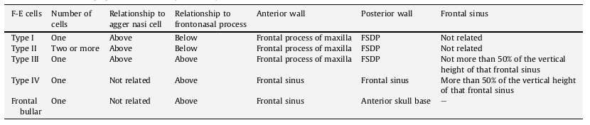

# Sinus / FESS CT 

## FESS CT Report [^Deutschmann2013] [^Hoang2009] [^Vaid2011] [^Mamluk2018]

**Glastonbury** states 5 main parts of a report. 

1. Sinus Opacification and Disease.  
2. Sinus Drainage Pathways.
3. Anatomical Variants. 
4. Critical Variants.
5. State of other regions. 

'description of sinus disease should include the pattern and location; presence of mucosal thickening, opacification, or mass; and associated bone changes of erosion, sclerosis, or sinus expansion. 

### Normal Mucosa:

= <4mm in Maxillary Sinus, <2mm in Ethmoid Sinus & Nose. Generally not seen in the Frontal or sphenoids in healthy patients

### Lund & Mackay Scoring System for CRS. 

0 = Absent or No opacification 
1 = Partial Opacification.  
2 = Complete Opacification.  
> Stuart Viner (Lecture at BSHNI 2022): Do not count minor mucosal thickening. 'Complete opacification' is 100%! not 90%. 

And scored on: 
Frontal  Sinuses : RIGHT & LEFT. 
Anterior Ethmoid : RIGHT & LEFT. 
Posterior Ethmoid: RIGHT & LEFT.
Maxillary Sinuses: RIGHT & LEFT.
Sphenoid Sinuses : RIGHT & LEFT.
Ostiomeatal Units: RIGHT & LEFT. (0 = Unopacified, 2 = Opacified.)

Thus, Scored from 0-24.

#### Variants on Lund-Mackay.  
*Pediatric Sinus Scoring System*[^Melder2021]
3 differences: 
1. Assess each station as A = Absent, U = Underdeveloped or D = Developed.  
Absents always score 0. Underdeveloped score 0.5 x score.  
2. Score is still 0, 1 or 2 but now 0-25% = 0, 25-75% = 1, >75% = 2.  
3. The OMU is still scored the same but as the denominator can vary, it is adjusted by multiplication factor so that it is divided by 24 to make it comparable with the Lund-Mackay score.

*Zinreich*   
Better for overall disease burden but more long-winded.  

Score 0 - 5 rather than 0-2 for each sinus   
and OMU = 0, 1 or 2.   
So, can score up to 54. 

--- 

### System of Review [^Vaid2011]

**1. Nasal Septum** 
 - Septal Deviation & Pneumatization. -> Limit access. Need septoplasty.
 - Thick bone -> Need bigger drill. 

**2. Middle Turbinate.**
 - Attachments -> Posterior Attachment to LP is the basal lamella. Even more posteriorly tends to attach to the Maxillary sinus wall. In post-op the anterior-superior part is often the only part identifiable. 
 - Variants -> Causing narrowing = Concha bullosa , Interlamellar cell of Grunwald and paradoxical curvature.  

**3. Uncinate Process** 
 - Superior Attachments -> Can be anterior skull base, the lamina papyracea or the middle turbinate. This determines how the Frontal sinus drains. Acute angle of attachment with the LP is a risk for orbital penetration.
 - Lateral Orientation / Deviation -> may be seen in small or hypoplastic maxillary sinus and is a risk for orbital penetration.

**4. OMC & Maxillary Sinus** 
 - View in Coronal and assess for mucosal disease, patency of maxillary ostium and encroachment of Haller cells.
 - Accessory Maxillary Ostium ~20% of patients 

**5. FDSP**
 - Identify Frontal ostium and recess. Patency & size. 
 - Frontal Beak -> If thick needs big drill.
 - (Agger Nasi -> pneumatization = surgical landmark as anterior border of the frontal recess.)
 - Frontoethmoidal Cells = ***Wormald Classification***. Based on position of cells in relation to the agger nasi cell, frontal beak and degree of extension into frontal sinus.

- *Frontal Bullar* cells = Start in suprabullar region and extend into frontal sinus along anterior margin of the skull base. Anterior wall is frontal sinus. Posterior wall is anterior skull base. Can be hazardous when penetrating as may damage skull base. 
- Interfrontal Sinus Septal Cell = Is within the interfrontal sinus septum -> Can narrow frontal ostium.  

 - Frontal Sinus -> Pneumatization and lateral extent. Need to remove all cells. If large may need lateral trepination in which case beware posterior wall dehiscence.  

**6. Anterior Ethmoidal Cells, Bulla Ethmoidalis, Supraorbital Cells**
 - Bulla Ethmoidalis = Largest anterior ethmoidal cell = Surgical landmark. But if small then LP has medial projection (*torus lateralis*) -> Risk of orbital trauma.
 - Supraorbital cells = Identify. Extend above the orbit -> Can displace anterior ethmoidal artery posteriorly and can be mistaken at operation for the Frontal sinus 

**7. Basal Lamella** 
 - Pneumatized -> Identify as can be mistaken as a posterior ethmoidal cell. 
 - 'Missed basal lamella' -> Identify. = misses the LP and attaches to the lateral maxillary wall. This divides maxillary sinus into larger anterior component draining into middle meatus and smaller posterior component draining into superior meatus.

**8. Posterior Sinus Group** = Posterior Ethmoids and Sphenoidal Cells.
 - (Vertical distance from Superior border maxillary sinus to roof of posterior ethmoidal cells on Coronal CT. If small or asymmetric, then at risk of penetration)
 - Onodi Cell = lateral and posterior pneumatization of the most posterior ethmoidal cell. 10% of population. Identify. Increase risk of damage to the Optic nerves.
 - Sphenoidal Sinus -> Pneumatization & Size. Pneumatization = Conchal (does not abut the sella), Pre-sellar (abuts the anterior part), Sella ( abuts more than just the anterior part), Post-sellar(abuts the posterior part of the sella ) 
 - Bony coverage of ICA, ONs, Vidian canals, Vii branches in foramen rotundum. ICA is bony dehiscent in 22% and ON in 4%. 
 - Sphenoidal intersinus septa reaching ICA or ON -> Identify as increased risk of damage. 

**9. Anterior Skull Base**
 - Level and slope of Fovea Ethmoidalis (= lateral part of ethmoid anterior skull base ) -> Identify and comment if asymmetric and/or the level through the mid-orbital plane. Both features risk ASB penetration.  
 - Depth of Olfactory fossa. = KEROS system ~ length of lateral lamella of cribiform plate (Type I = <3mm, Type II = 3-7mm, Type >7mm)

**10. Anterior Ethmoid Artery**
 - Identify dehiscence and if on a pedicle.  

**11. Lamina Papyracea** 
 - Focal Dehiscence -> Risk of penetration (5% of population).
 - Lateral Orientation -> Identify -> Normally the plane lines up with the maxillary sinus ostium but if the maxillary sinus is small then the LP can be relatively medial and at risk of penetration. 

**12. Bony Margins of Sinuses** 
 - Thickness or Hyperostosis. 
 - Aggressive Erosion, bone remodelling or pressure erosion. (-> underlying disease)

**13. Brain, Orbit and nasopharynx.**
 - Be careful not to miss advanced disease. 

--- 

### Post- Operative:

1. Focus on Frontal drainage pathway and its patency:
? lateralisation of the middle turbinate.
? persistent frontal recess cells.

2. Assess completeness of uncinatomy and ? whether it is too far posterior. 
   Assess extent of ethmoidectomy +/- any post-op synechiae ⇒ obstructed sinus drainage.Persistent sinus opacification ? due to viscous secretions. 
	
3. Assess integrity of the middle turbinate attachment to the anterior skull base. - ? dehiscence
	? any defect in the lamina papyracea.

--- 

## Development and Paediatric Consideration.

### Lund & Mackay Score in Paediatric Chronic Rhinosinusitis Diagnosis  

Bizarrely there is a small, reasonable conducted trial demonstrating that it does, compared with 'normals undergoing sinus CT for other reasons.'[^Bhattachrayya2004]  

And, they say a cut of for the diagnosis of CRS vs Normal is 5 or 6.

Whilst <2 is ~ 100% NPV.  
And, >10 is ~ 100% PPV.

But, the score does not appear to differentiate the degree of improvement in symptoms post FESS [^Bhattachrayya2006].

### Development. [^Melder2021] 

Sinuses appear, generally in order of Ethmoids, Maxillary, Sphenoids then Frontal.  
So at 7-11yrs: Absent or Underdeveloped:[^Melder2021] 
 - Frontal = 50%  
 - Sphenoids = 30%
 - Maxillary = 20% 
 - Ethmoids underdevelopment is unusual. 

 *Shah* Criteria for Full Development. [^Shah2003] 
> ie the sinus would be considered as D = Developed once it has reached these criteria. 

 - Frontal = Extends superiorly (sic) to the vertical portion of the Frontal bone.
 - Maxillary = Extends inferiorly below the nasal floor and laterally as far as the zygomatic process.
 - Ethmoids = Extend superiorly to the level of the cribiform plate.
 - Sphenoids = Extend laterally and superior to the optic structs.

---

## FESS ANATOMY

[^Deutschmann2013]: Deutschman M W et al. Radiologic Reporting for Paranasal Sinus Computed Tomography:
A Multi-Institutional Review of Content and Consistency Laryngoscope, 123:1100–1105, 2013
[^Hoang2009]: Hoang J, Glastonbury C et al. Multiplanar Sinus CT: A Systematic Approach to  Imaging Before Functional Endoscopic Sinus Surgery. AJR 2010; 19 4:W 527–W 5 36
[^Mamluk2018]: Mamluk M et al. Contextual Radiology Reporting: A New Approach to Neuroradiology Structured Templates. AJNR Am J Neuroradiol 39:1406 –14 Aug 2018
[^Vaid2011]: Vaid S et al. An imaging checklist for pre-FESS CT: framing a surgically relevant report. Clin Rad 66(2011):459-470 
[^Melder2021]: Melder K et al. The Pediatric Sinus Staging System: A CT-based Approach to Grading Pediatric Sinus Disease. Laryngoscope. 2021 February ; 131(2): E642–E648. doi:10.1002/lary.28752
[^Shah2003]: Shah R et al . Paranasal Sinus Development: a radiographic study Laryngoscope. 2003; 113(2): 205–9.
[^Bhattachrayya2004]: Bhattacharyya N et al. The Diagnostic Accuracy of Computed Tomography in Pediatric Chronic Rhinosinusitis. Arch Otolaryngol Head Neck Surg. 2004;130(9):1029-1032. doi:10.1001/archotol.130.9.1029
[^Bhattachrayya2006]: Bhattacharyya N. Radiographic Stage Fails to PredictSymptom Outcomes after Endoscopic SinusSurgery for Chronic Rhinosinusitis. Laryngoscope,116:18–22, 2006
