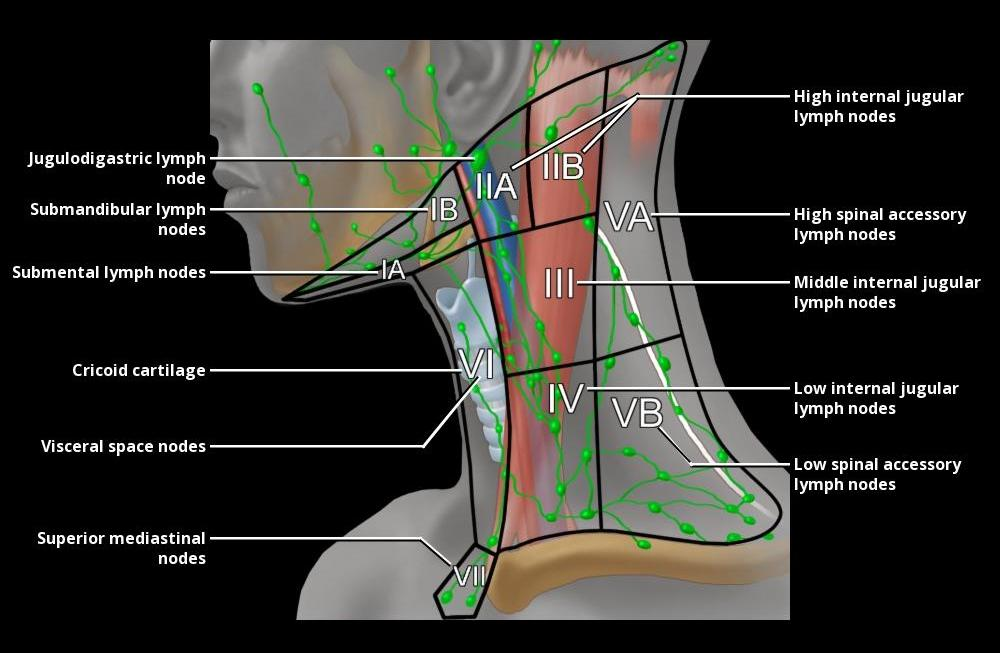
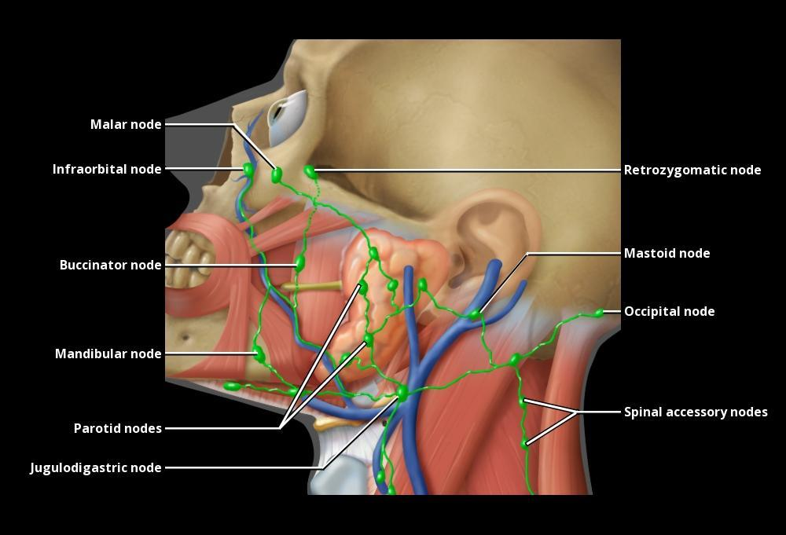
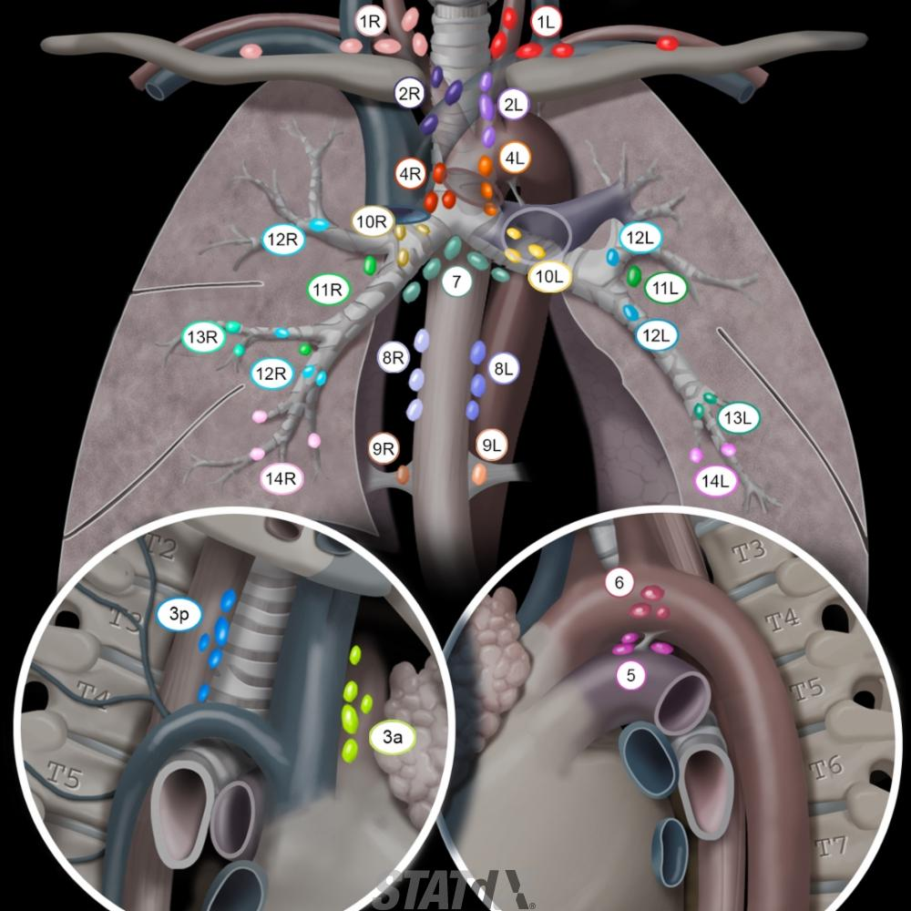
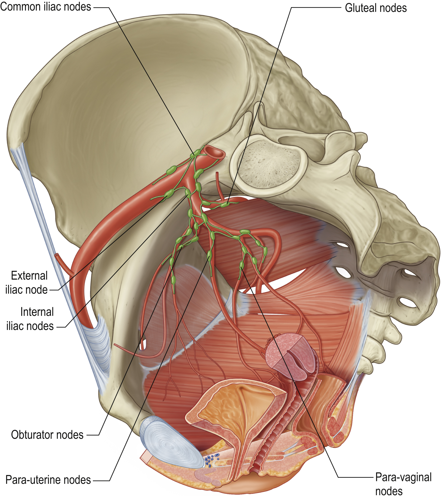

# Nodes 

[^Sahdev]: Sahdev A and Vinnicombe S. Husband & Resnek Imaging in Oncology. CRC Press 2020. 
[^Vattoth]: Vattoth S & Chapman P. 2023 https://my.statdx.com/document/cervical-lymph-nodes
[^Carter]: Carter B. 2023 https://my.statdx.com/document/iaslc-lymph-node-map/f1a3b872-134d-435a-a362-3cec0606bed8
[^Padhani]: Padhani A. 2014. RCR Recommendations for Cross-Sectional Imaging in Cancer Management. 2022 Update.
[^Grays]: Stanford S. Grays Anatomy 2021.

## Anatomy [^Sahdev] [^Vattoth]

### Neck

#### Definitions 
**Level 1** *Submandibular & Submental*
 - Level 1A: Submental Nodes. Between anterior bellies of digastric M. 
 - Level 1B: Submandibular Nodes.  

**Level 2** *Jugulodigastric*  
 - Level 2A: Anterior, medial, lateral, or posterior to IJV; if posterior to IJV, node must be inseparable from IJV; contains jugulodigastric nodal group. 
 - Level 2B: Posterior to the IJV and MUST have fat plane separating them.  

**Level 3** *Deep Cervical*  
From Hyoid to the lower border of the Cricoid. 

**Level 4** *Virchow*   
From lower border of Cricoid to the clavicle.

**Level 5** *Accessory Spinal or Posterior Triangle*  
Posterior to the posterior border of the SCM.  
 - Level 5A: Skull base to the level of the cricoid.  
 - Level 5B: From level of the cricoid to the clavicle.

**Level 6** *"Visceral Space". Prelaryngeal/Pretracheal/Delphian node*  
From Hyoid to top of the manubrium. 

**Level 7** *Superior Mediastinal*  
From the top of the manubrium to the innominate vein and between the carotids.

  

--- 

### Chest [^Carter] 

This is used for staging lung cancers but is excessive for other tumours.  

Divides into 14 nodal stations and 7 Stations. 

**Lymph node zones:**
 - Supraclavicular zone: Station 1
 - Upper zone (superior mediastinal): Stations 2, 3, and 4
 - Aortopulmonary zone: Stations 5 and 6
 - Subcarinal zone: Station 7
 - Lower zone (inferior mediastinal): Stations 8 and 9
 - Hilar and interlobar zone (pulmonary): Stations 10 and 11
 - Peripheral zone (pulmonary): Stations 12, 13, and 14

For other carcinomas then use: 

1. Chest Wall
2. Anterior Mediastinal 
3. Paratracheal and Tracheobronchial 
4. Hilar
5. Intrapulmonary
6. Diaphragmatic Nodes 
7. Paracardiac nodes

> Chest Wall = Axillary, Supraclavicular, Internal Mammary & Posterior Intercostal.
> Anterior Mediastinal = Prevascular & Para-aortic.
> Paratracheal & Tracheobronchial = Paratracheal, Retrotracheal, Aortopulmonary, Azygos & Subcarinal.
> Posterior Mediastinal = Para-oesophageal and pulmonary ligament.

In Lymphoma then use Nodal REGIONS. 

---
### Abdomen  

| Region | Sites | Notes | 
|:---|:---|:---|
| Retroperitoneum | Paracaval, precaval, retrocaval, aortocaval, preaortic and para-aortic | | 
| Celiac Axis | include Greater & lesser curvature nodes, pancreaticoduodenal nodes and porta hepatis | |
| SMA | Mesenteric nodes | | 
| IMA | including mesenteric nodes in sigmoid mesentery and the superior rectal vessels. |  

--- 

### Pelvis

Confusing nomenclature and lack of definitions. 

Generally Common Iliac, External Iliac and Inguinal (inferior to the inguinal ligament) are easy to define.   
and behind them are the Presacral nodes.

The internal iliacs are more challenging to be categorical about.   

But, I would say: [^Grays]   
 - Obturator nodes follow the anterior division of the Internal Iliacs. But Husband says it is medial chain of External Iliac
 - Hypogastric nodes follow the middle/posterior division of the Internal Iliacs 
   - *and the internal iliacs are sometimes conglomorated with them*
 - Also there is the 3rd branch which is the gluteal.

---
## Normal & Abnormal [^Padhani]

| Region | Site | RCR SAD (mm) | Husband & Resnek | 
|:---|:---|:---:|:---:|
| Head + Neck | Facial | Not visible | |
| | Cervical | 8 or  10 for Jugulodigastric | |
| Axilla | | 10 | | 
| Mediastinum | Subcarinal | 12 | | 
| | Paracardiac | 8 | 12 |
| | Retrocrural | 6 | 6 |
| | All other sites | 10 | |
| Abdomen | Gastrohepatic | 8 | 8 | 
| | Porta hepatis | 8 | 7 |
| | Portocaval | 10 | 10 or 13 |
| | Celiac Axis to Renal Artery | 10 | 9 | 
| | Renal Artery to Bifurcation | 12 | 11 | 
| | Mesenteric | | 5 | 
| Pelvis | Common Iliac | 9 | 10 |
| | External Iliac | 10 | 10 | 
| | Internal Iliac | 7 | 10 |
| | Obturator | 8 | 10 | 
| Inguinal | | 10 | 15 | 

> RCR criteria based on AXIAL slices. 

### Neck 

*1-cm cutoff in largest axial diameter shows 88% sensitivity & 39% specificity, whereas 1.5-cm cutoff shows 56% sensitivity & 84% specificity for metastatic head & neck cancer* [^Vattoth]

## Drainage Pathway.[^Sahdev]

| Tumour | Initial Drain Site | Then to... |
|:---|:---|:---|
| Vulval, Penis, Anus | Inguinal Nodes | |
| Prostate | Any of the lower pelvic groups | Common Iliac / Para-aortic | 
| | 60% go to Obturator and Ext Iliacs | |
| | but 20% are ONLY in presacral locally. | |
| Bladder | Paravesical | Obturator & External Iliacs then Common Iliacs |
| | | or Hypogastric & Presacral then Common Iliacs | 
| Cervix, Ovary & Uterine | Obturator | External Iliac then Commmon Iliac |
| Right Side Colonic | Ileocolic | SMV |
| Left Side Colonic | IMV | | 
| Rectum | Mesorectal | Superior Rectal | 
| | Occasional to pelvic side wall. | 
| Testes | RIGHT: Right retroperitoneal LEFT: Left retroperitoneal at level of the renal vein | | 
| Upper GI Malignancy | Hepatoduodenal, peripancreatic and aortocaval | |  
| Kidneys | Ipsilateral Renal Vein | Para-aortic / paracaval nodes |
| Lung | Ipsi hilar nodes | Mediastinal Nodes (esp Paratracheal + Tracheobronchial Nodes) |
| Pleura | Nodes along chest wall (inc posterior intercostal, internal mammary, diaphrgamatic ) |
| Breast | Axillary | Subpectoral & Supraclavicular | 

> Upper GI = Gastric, pancreatic, liver, gallbladder and bile ducts.
> Breast = Tumours tend to spread to one node first = "Sentinel" nodes.
> GCT in testes are usually to abdomen in the first place, unless prior scrotal sugery, tumour in undescended testis, retrograde lymphatic spread secondary to bulky retroperitoneal disease or prior nodal dissection. 
> Echelon Node = In testicular Ca is anterior to the iliopsoas. Uncommon. 

## Probability of Involvement 

| Tumour | T1 | T2 | T3 | T4 | 
|:---|:---|:---|:---|:---|
| Prostate | <5% | <5% | 15-30% | >40% |
| Bladder | <5% | 10-20% | 40% | 45% | 
| CRC | 5% | 20% | >50% | >50% |
| Ovary | 10% | 15% | 35% | >50% |

Other features also predict nodal Involvement including grade, vascular invasion, depth of invasion, high PSA etc
## Treatment Change.

Post Therapy the pattern of relapse changes so,  
Prostate post RT or RP with LND, relapse is outside pelvis.  
Bladder post radical cystectomy, relapse often in hypogastric / internal iliac nodes, presacral and para-aortic nodes.

